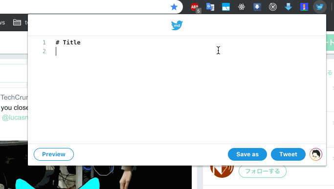

<h1 align="center">Twitter MD Chrome Extension</h1>

  

<h2 align="center">About</h2>

Extend Twitter to tweet markdown.

  

<h2 align="center">Installation</h2>

1. [download chrome extension zip](https://github.com/RyosukeCla/twitter-md-chrome/archive/v1.1.0.zip)
2. unzip it
3. go to [chrome://extension](chrome://extension)
4. click `Load Unpackaged Chrome Extension`
5. load unziped chrome extension dir

<h2 align="center">Features</h2>

- Twitter-like UI
- Github flavored markdown
- Math formula
  - Inline math
  - Display math
- Syntax highlight
- Tweet md as png

<h2 align="center">Examples</h2>

- [readme](./examples/readme.md.raw)
- [syntax highlight](./examples/syntax-highlight.md.raw)
- [math](./examples/math.md.raw)
